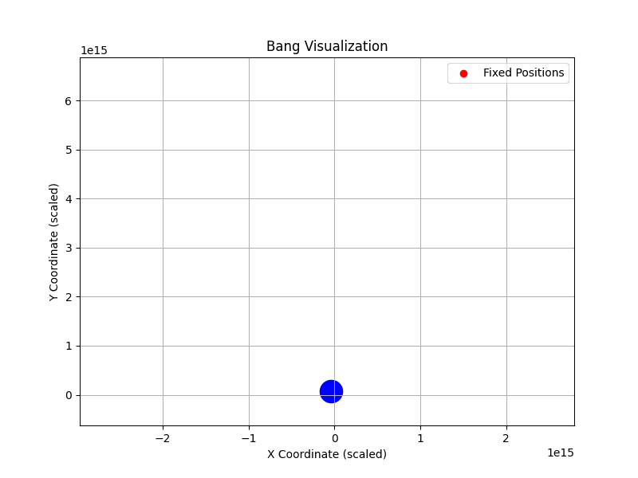
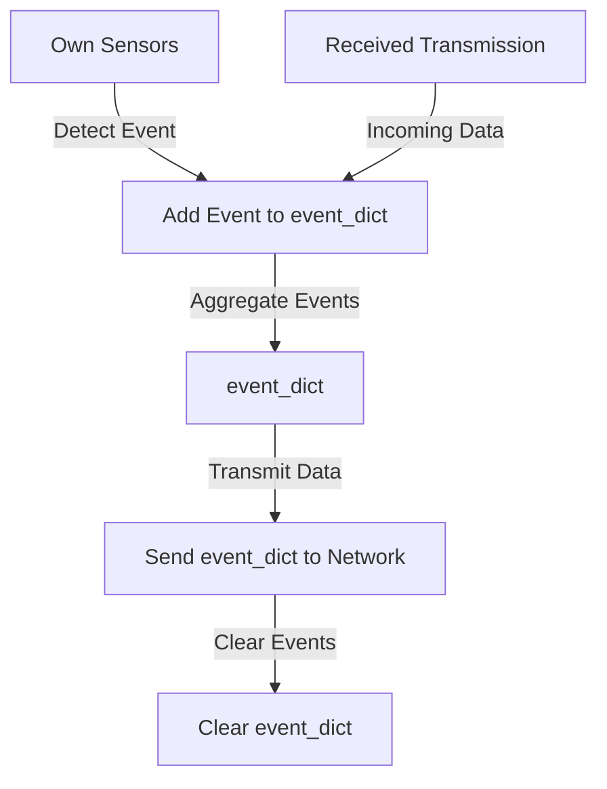
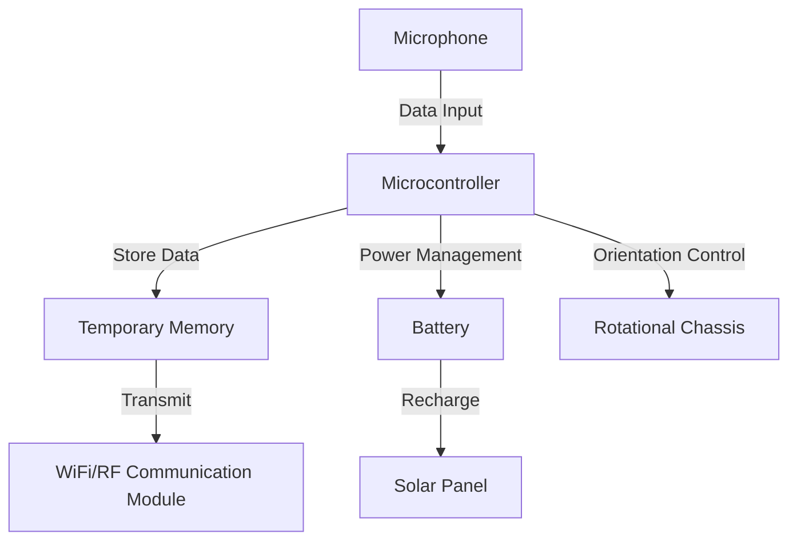

# Hackaton submission
For 2024 https://www.defense-tech-hackathon.com/ on USS Hornet Open space Museum.

## Idea: Localise location of noise from 3 interconnected listeners

The idea is that networked microphones are available everywhere (drones, burnerphones). By connecting them over local network and updating eachother on the arrival times of noise (from ex artillery, gunfire). 

### Demo
Start 3 laptops as listeners with:
```
conda create -n hcktn2 python=3.10
conda activate hcktn2
conda install portaudio # or brew install portaudio
pip install -r audio_stream_listener/requirements.txt

python audio_stream_listener/main.py 4094 './output.jsonl'
```

Organize them in an equilateral triangle. When script is started on the other device you can connect to them via
```
connect 192.168.0.55 4091 
```
This will stream coordinates to './output.jsonl'

Run the [notebook](./notebooks/plot-res.ipynb) to plot the results.




##### Comments
This ended up not being very accurate but it seems promising

# Final design (not part of original submission):

# **Dropped Mesh Device**

This document describes the design and functionality of the Dropped Mesh Device, a compact, self-powered system for detecting and sharing environmental events within a triangulated mesh network. The recording devices operates autonomously, dynamically responding to detected events or received transmissions. Its versatile design allows repurposing of existing devices such as drones or mobile phones, leveraging their built-in receivers, transmitters, sensors, and batteries.

---

## **System Overview**

The Dropped Mesh Device operates as a node in a distributed mesh network, performing three primary tasks:
1. Detect events in its environment using onboard sensors.
2. Populate and transmit a list of recent events when triggered by either an event detection or external communication.
3. Receive and relay data from other network nodes for redundancy and collaboration.

---

## **Core Components**

1. **Microcontroller**:
   - Manages event detection, aggregation, and communication.
   - Coordinates the power system, including battery and solar panel.

2. **Sensors (e.g., Microphone)**:
   - Detect environmental events such as audio signals and vibrations.
   - The system could be extended with additional sensors, such as RF detectors, to monitor radio frequency signatures for specific applications like detecting electronic activity or distress beacons.

3. **WiFi/RF Communication Module**:
   - Sends aggregated event data to the network.
   - Receives transmissions from other nodes, triggering collaborative actions.

4. **Battery**:
   - Powers the device and ensures operation in low-light conditions.
   - Rechargeable via the solar panel.

5. **Solar Panel**:
   - Extends operational lifetime by recharging the battery during daylight hours.

6. **Rotational Chassis**:
   - A self-orienting frame that ensures critical components (e.g., solar panel and sensors) face upward after deployment.

7. **Temporary Memory**:
   - A transient storage system for maintaining the event list between operations.

---

## **Operation Workflow**

### **1. Event Detection**
- The device continuously monitors its surroundings using onboard sensors.
- Upon detecting an event, it:
  - Logs the event to a transient memory dictionary (`event_dict`), which may include:
    - **Timestamp**
    - **Amplitude**
    - **Event Type**

### **2. Event Dictionary Population**
- The `event_dict` is populated by two sources:
  1. **Own Sensors**: New events detected by the device’s microphone or other onboard sensors.
  2. **Received Transmissions**: Event data received from other nodes, ensuring redundancy and network collaboration.

### **3. Triggering Data Transmission**
- Transmission is triggered when:
  1. A new event is detected.
  2. A message is received from the network prompting the device to share its current event data.
- Once triggered, the device sends the `event_dict` to the network using the following structure:

```json
[
  {"device_ID": "<unique identifier>", "time": "<timestamp1>", "amplitude": "<value1>", "type": "<event1>"},
  {"device_ID": "<unique identifier>", "time": "<timestamp2>", "amplitude": "<value2>", "type": "<event2>"}
]
```

- After successful transmission, the `event_dict` is cleared.

### **4. Data Reception**
- The device remains ready to receive data or commands from other network nodes. Incoming transmissions can:
  - Trigger the device to send its own event data.
  - Add external event data to the `event_dict` for redundancy and synchronization.

---

## **Drones as Mesh Nodes**

Drones equipped with microphones, transmitters, receivers, and onboard batteries can serve as Dropped Mesh Devices upon crash. By outfitting the drone with a small solar panel, the crashed drone can continue to operate indefinitely as a mesh node. 

### **Advantages of Using Drones**
- **Repurposing Post-Crash**: A drone that is no longer capable of flying can still serve as a stationary detection and communication device.
- **Pre-installed Hardware**: Most drones already include sensors, batteries, and communication modules, reducing the need for additional components.
- **Energy Sustainability**: A small solar panel allows the drone to recharge its battery and continue functioning in the network even in remote or inaccessible areas.
- **Wide Deployment**: Drones can be deployed across large areas and, upon crashing, contribute to network density and coverage.

---

## **System Diagrams**

### **Data Flow Diagram**


---

### **Components Overview**


---

## **Key Use Cases**

1. **Environmental Monitoring**:
   - Detect and relay seismic activity, sound events, or other environmental changes in real time.
2. **Disaster Response**:
   - Rapid deployment for event detection and communication in emergency scenarios.
3. **Wildlife Tracking**:
   - Monitor animal activity in remote areas with minimal human interference.
4. **Tactical Surveillance**:
   - Enable event detection and communication in covert or challenging environments.
5. **Drone Repurposing**:
   - Crashed drones with a small solar panel can continue to contribute to the mesh network, ensuring resourceful use of equipment.

### Detection Range Examples

| **Event Type**               | **Sound Level at Source** | **Smartphone Microphone (-42 dB ±3 dB)** | **Drone-Equipped Microphone (-50 dB ±2 dB)** | **Purpose-Built Microphone (-60 dB ±1 dB)** |
|------------------------------|---------------------------|-------------------------------------------|-----------------------------------------------|-----------------------------------------------|
| **Whisper (~30 dB)**         | 30 dB                     | Up to **10 meters**                        | Up to **15 meters**                            | Up to **25 meters**                            |
| **Normal Conversation (~60 dB)** | 60 dB                 | Up to **100 meters**                       | Up to **150 meters**                           | Up to **250 meters**                           |
| **Gunshot (~140 dB)**        | 140 dB                    | Up to **500 meters**                       | Up to **750 meters**                           | Up to **1 kilometer**                          |
| **Artillery Fire (~160 dB)** | 160 dB                    | Up to **2 kilometers**                     | Up to **3 kilometers**                         | Up to **4 kilometers**                          |
| **Drone Noise (~65 dB @100 ft)** | 65 dB                | Up to **300 meters**                       | Up to **450 meters**                           | Up to **600 meters**                           |
| **Explosion (~170 dB)**      | 170 dB                    | Up to **3 kilometers**                     | Up to **4 kilometers**                         | Up to **5 kilometers**                          |

_Note: Actual detection ranges can vary based on environmental conditions, obstacles, atmospheric conditions, background noise levels, and microphone placement._

---

## **System Limitations**

- **Physical**: Limited -60dB microphone sensitivity, 5km maximum range for loudest events, solar panel requires >4hrs daily sunlight for sustainable operation.
- **Network**: Node separation >1km risks mesh fragmentation, 2.4GHz RF subject to environmental interference, 802.11 protocol vulnerable to replay attacks. Signal drops 80% through dense foliage, 50ms minimum inter-node latency.
- **Operational**: 24hr battery life without solar input, detection accuracy drops by 40% during precipitation, repurposed drone microphones average -50dB sensitivity. Sound source localization requires minimum 3 devices recording same event, though devices can self-localize through repeated loud events.
